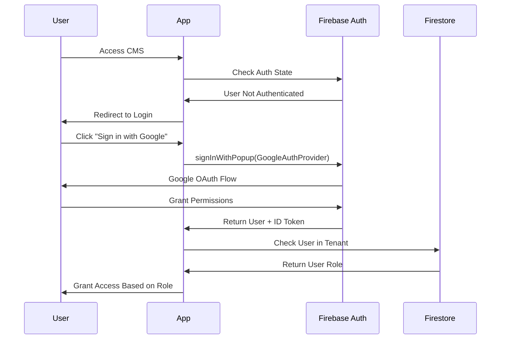

# 🏗️ Architecture Overview

Comprehensive guide to Puka Digital CMS architecture and design decisions.

## 📋 Table of Contents

1. [System Overview](#system-overview)
2. [Multitenant Architecture](#multitenant-architecture)
3. [Database Design](#database-design)
4. [Authentication & Authorization](#authentication--authorization)
5. [API Layer](#api-layer)
6. [Frontend Architecture](#frontend-architecture)
7. [Security Model](#security-model)
8. [Performance Considerations](#performance-considerations)

---

## 🌐 System Overview

Puka Digital CMS is a modern, scalable multitenant headless content management system designed for marketing teams and agencies managing content across multiple projects.

### Key Design Principles

- **Tenant Isolation**: Complete data separation between tenants
- **Scalability**: Horizontal scaling support through Firebase
- **Security First**: Role-based access control and secure APIs
- **Developer Experience**: Modern stack with TypeScript and comprehensive APIs
- **Performance**: Optimized for fast content delivery and editing

### Architecture Diagram

```
┌─────────────────────────────────────────────────────────────┐
│                    External Websites                        │
│  ┌─────────────┐  ┌─────────────┐  ┌─────────────────────┐  │
│  │   Next.js   │  │   React     │  │  Vanilla JS / PHP   │  │
│  │   Website   │  │   Website   │  │     Website         │  │
│  └─────────────┘  └─────────────┘  └─────────────────────┘  │
└─────────────────────────────────────────────────────────────┘
                              │
                              │ REST API Calls
                              ▼
┌─────────────────────────────────────────────────────────────┐
│                 Puka Digital CMS (Next.js)                 │
│                                                             │
│  ┌─────────────────┐    ┌─────────────────┐                │
│  │   CMS Interface │    │   Public APIs   │                │
│  │   /cms/*        │    │   /api/*        │                │
│  └─────────────────┘    └─────────────────┘                │
│                                                             │
│  ┌─────────────────┐    ┌─────────────────┐                │
│  │  Admin Panel    │    │  Auth Layer     │                │
│  │  /admin/*       │    │  Firebase Auth  │                │
│  └─────────────────┘    └─────────────────┘                │
└─────────────────────────────────────────────────────────────┘
                              │
                              │ Firebase SDK
                              ▼
┌─────────────────────────────────────────────────────────────┐
│                      Firebase Services                      │
│                                                             │
│  ┌─────────────────┐    ┌─────────────────┐                │
│  │   Firestore     │    │  Authentication │                │
│  │   Database      │    │    (Google)     │                │
│  └─────────────────┘    └─────────────────┘                │
│                                                             │
│  ┌─────────────────┐    ┌─────────────────┐                │
│  │   Storage       │    │   Hosting       │                │
│  │   (Images)      │    │   (Optional)    │                │
│  └─────────────────┘    └─────────────────┘                │
└─────────────────────────────────────────────────────────────┘
                              │
                              │ CDN Integration
                              ▼
┌─────────────────────────────────────────────────────────────┐
│                       Cloudinary                           │
│                   Media Management                         │
└─────────────────────────────────────────────────────────────┘
```

---

## 🏢 Multitenant Architecture

### Tenant Isolation Strategy

The CMS implements **schema-based multitenancy** using Firestore's collection structure:

```
firestore/
├── tenants/
│   ├── {tenantId}/
│   │   ├── blogs/
│   │   │   └── {blogId}/
│   │   └── users/
│   │       └── {userId}/
│   └── metadata/
└── global/
    └── system/
```

### Tenant Structure

```typescript
interface Tenant {
  id: string;                    // Unique tenant identifier
  name: string;                  // Display name
  domain?: string;               // Custom domain (optional)
  plan: SubscriptionPlan;        // Subscription tier
  createdAt: Timestamp;          // Creation date
  settings: TenantSettings;      // Configuration
  users: TenantUser[];          // Authorized users
}

enum SubscriptionPlan {
  FREE = 'FREE',           // 10 blogs, 2 users
  STARTER = 'STARTER',     // 100 blogs, 5 users
  PRO = 'PRO',            // 1000 blogs, 20 users
  ENTERPRISE = 'ENTERPRISE' // Unlimited
}
```

### Benefits of This Approach

1. **Complete Data Isolation**: Each tenant's data is completely separated
2. **Scalability**: Firebase handles scaling automatically
3. **Security**: Firestore rules ensure tenant boundaries
4. **Flexibility**: Easy to add new tenants and features
5. **Performance**: Efficient queries within tenant scope

---

## 🗄️ Database Design

### Firestore Collections Structure

#### Tenants Collection
```
/tenants/{tenantId}
├── name: string
├── domain?: string
├── plan: SubscriptionPlan
├── createdAt: Timestamp
├── settings: {
│   ├── branding: {
│   │   ├── logo?: string
│   │   ├── primaryColor: string
│   │   └── secondaryColor: string
│   │   }
│   ├── features: {
│   │   ├── commentsEnabled: boolean
│   │   ├── seoOptimization: boolean
│   │   └── customDomains: boolean
│   │   }
│   └── limits: {
│       ├── maxBlogs: number
│       ├── maxUsers: number
│       └── storageLimit: number
│       }
│   }
└── users: TenantUser[]
```

#### Blogs Subcollection
```
/tenants/{tenantId}/blogs/{blogId}
├── title: string
├── content: string
├── excerpt: string
├── slug: string (unique within tenant)
├── featuredImage?: string
├── alt?: string
├── author: {
│   ├── name: string
│   ├── email: string
│   └── uid: string
│   }
├── status: 'draft' | 'published' | 'archived'
├── seo: {
│   ├── metaTitle?: string
│   ├── metaDescription?: string
│   └── keywords: string[]
│   }
├── blocks: ContentBlock[]
├── createdAt: Timestamp
├── updatedAt: Timestamp
└── publishedAt?: Timestamp
```

#### Users Subcollection
```
/tenants/{tenantId}/users/{userId}
├── email: string
├── name: string
├── role: UserRole
├── avatar?: string
├── addedAt: Timestamp
├── lastLoginAt?: Timestamp
└── permissions: {
    ├── canCreateBlogs: boolean
    ├── canEditAllBlogs: boolean
    ├── canDeleteBlogs: boolean
    └── canManageUsers: boolean
    }
```

### Indexing Strategy

Firestore automatically indexes single fields, but composite indexes are needed for:

1. **Blog Queries by Tenant**:
   - `tenantId + createdAt` (descending)
   - `tenantId + status + createdAt` (descending)
   - `tenantId + author.uid + createdAt` (descending)

2. **Search Functionality**:
   - `tenantId + title` (for title search)
   - `tenantId + status + title` (for published search)

3. **User Management**:
   - `tenantId + role`
   - `tenantId + addedAt` (descending)

---

## 🔐 Authentication & Authorization

### Authentication Flow



### Role-Based Access Control (RBAC)

```typescript
enum UserRole {
  ADMIN = 'admin',       // Full access to tenant
  EDITOR = 'editor',     // Create/edit content
  VIEWER = 'viewer'      // Read-only access
}

interface Permission {
  resource: string;      // 'blogs', 'users', 'settings'
  action: string;        // 'create', 'read', 'update', 'delete'
  scope: string;         // 'own', 'all', 'tenant'
}

const rolePermissions: Record<UserRole, Permission[]> = {
  admin: [
    { resource: '*', action: '*', scope: 'tenant' }
  ],
  editor: [
    { resource: 'blogs', action: '*', scope: 'all' },
    { resource: 'users', action: 'read', scope: 'tenant' },
    { resource: 'settings', action: 'read', scope: 'tenant' }
  ],
  viewer: [
    { resource: 'blogs', action: 'read', scope: 'all' },
    { resource: 'users', action: 'read', scope: 'own' }
  ]
};
```

### Security Rules

Firestore security rules ensure tenant isolation:

```javascript
// Firestore Rules
rules_version = '2';
service cloud.firestore {
  match /databases/{database}/documents {
    // Tenant access control
    match /tenants/{tenantId} {
      allow read, write: if isAuthorizedForTenant(tenantId);
      
      // Blogs within tenant
      match /blogs/{blogId} {
        allow read: if true; // Public read for APIs
        allow write: if isAuthorizedForTenant(tenantId) 
                    && hasPermission('blogs', 'write');
      }
      
      // Users within tenant
      match /users/{userId} {
        allow read, write: if isAuthorizedForTenant(tenantId)
                          && hasPermission('users', 'manage');
      }
    }
    
    function isAuthorizedForTenant(tenantId) {
      return request.auth != null 
             && exists(/databases/$(database)/documents/tenants/$(tenantId)/users/$(request.auth.uid));
    }
    
    function hasPermission(resource, action) {
      let userDoc = get(/databases/$(database)/documents/tenants/$(tenantId)/users/$(request.auth.uid));
      return userDoc.data.permissions[resource + '_' + action] == true;
    }
  }
}
```

---

## 🔌 API Layer

### API Architecture

The API layer follows RESTful principles with clear separation of concerns:

```
src/app/api/
├── tenants/
│   └── [tenantId]/
│       ├── blogs/
│       │   ├── route.ts          # GET /api/tenants/{id}/blogs
│       │   └── [slug]/
│       │       └── route.ts      # GET /api/tenants/{id}/blogs/{slug}
│       ├── search/
│       │   └── route.ts          # GET /api/tenants/{id}/search
│       └── users/
│           └── route.ts          # POST/DELETE /api/tenants/{id}/users
├── auth/
│   └── route.ts                  # Authentication endpoints
└── health/
    └── route.ts                  # Health checks
```

### Request/Response Flow

```typescript
// API Request Flow
interface APIRequest {
  method: 'GET' | 'POST' | 'PUT' | 'DELETE';
  path: string;
  headers: Record<string, string>;
  body?: any;
  query?: Record<string, string>;
}

interface APIResponse<T = any> {
  success: boolean;
  data?: T;
  error?: string;
  message?: string;
  meta?: {
    count?: number;
    totalPages?: number;
    currentPage?: number;
  };
}
```

### Error Handling

Centralized error handling with consistent response format:

```typescript
class APIError extends Error {
  constructor(
    public statusCode: number,
    public message: string,
    public code?: string
  ) {
    super(message);
  }
}

const errorHandler = (error: unknown): APIResponse => {
  if (error instanceof APIError) {
    return {
      success: false,
      error: error.message,
      code: error.code
    };
  }
  
  return {
    success: false,
    error: 'Internal server error'
  };
};
```

---

## ⚛️ Frontend Architecture

### Component Structure

```
src/
├── app/                          # Next.js App Router
│   ├── (public)/                # Public routes
│   │   ├── blog/
│   │   └── api/
│   ├── admin/                   # Admin panel
│   └── cms/                     # CMS interface
├── components/                  # Reusable components
│   ├── common/                  # Shared components
│   ├── auth/                    # Authentication
│   ├── blogs/                   # Blog components
│   └── ui/                      # UI primitives
├── context/                     # React contexts
│   ├── TenantContext.tsx
│   ├── ThemeContext.tsx
│   └── AuthContext.tsx
├── hooks/                       # Custom hooks
│   ├── useAuth.ts
│   ├── useTenant.ts
│   └── useBlogs.ts
├── lib/                        # Utilities & services
│   ├── firebase.ts
│   ├── tenantService.ts
│   └── utils.ts
└── types/                      # TypeScript definitions
    └── index.ts
```

### State Management

The application uses React Context for global state management:

1. **TenantContext**: Current tenant and switching logic
2. **AuthContext**: User authentication state
3. **ThemeContext**: Dark/light mode and theming

### Data Fetching Strategy

- **Server Components**: For initial data loading (blogs list, tenant info)
- **Client Components**: For interactive features (forms, real-time updates)
- **API Routes**: For data mutations and external API access
- **React Query**: For client-side caching and synchronization (future enhancement)

---

## 🔒 Security Model

### Defense in Depth

1. **Authentication Layer**: Firebase Authentication with Google OAuth
2. **Authorization Layer**: Role-based access control
3. **Database Layer**: Firestore security rules
4. **API Layer**: Request validation and sanitization
5. **Transport Layer**: HTTPS encryption
6. **Input Validation**: XSS and injection prevention

### Data Protection

```typescript
// Input Sanitization
import DOMPurify from 'dompurify';

const sanitizeContent = (content: string): string => {
  return DOMPurify.sanitize(content, {
    ALLOWED_TAGS: ['p', 'h1', 'h2', 'h3', 'h4', 'h5', 'h6', 'strong', 'em', 'ul', 'ol', 'li', 'a', 'img'],
    ALLOWED_ATTR: ['href', 'src', 'alt', 'title', 'class']
  });
};

// Rate Limiting
const rateLimiter = {
  windowMs: 15 * 60 * 1000, // 15 minutes
  max: 100, // Limit each IP to 100 requests per windowMs
  message: 'Too many requests from this IP'
};
```

### CORS Configuration

```typescript
const corsOptions = {
  origin: process.env.NODE_ENV === 'production' 
    ? process.env.ALLOWED_ORIGINS?.split(',') 
    : ['http://localhost:3000', 'http://localhost:3001'],
  methods: ['GET', 'POST', 'PUT', 'DELETE', 'OPTIONS'],
  allowedHeaders: ['Content-Type', 'Authorization'],
  credentials: true
};
```

---

## ⚡ Performance Considerations

### Database Optimization

1. **Efficient Queries**: Limit results and use proper indexing
2. **Pagination**: Implement cursor-based pagination for large datasets
3. **Caching**: Use Firestore's built-in caching
4. **Connection Pooling**: Firebase handles this automatically

### Frontend Optimization

1. **Code Splitting**: Next.js automatic code splitting
2. **Image Optimization**: Cloudinary transformations
3. **Static Generation**: Pre-render public pages
4. **Incremental Static Regeneration**: Update static content on demand

### API Performance

```typescript
// Pagination Example
const getBlogs = async (tenantId: string, limit = 10, startAfter?: string) => {
  let query = collection(db, `tenants/${tenantId}/blogs`)
    .orderBy('createdAt', 'desc')
    .limit(limit);
    
  if (startAfter) {
    const startAfterDoc = await getDoc(doc(db, `tenants/${tenantId}/blogs`, startAfter));
    query = query.startAfter(startAfterDoc);
  }
  
  return getDocs(query);
};

// Caching Strategy
const cacheConfig = {
  blogs: { ttl: 5 * 60 * 1000 },      // 5 minutes
  tenants: { ttl: 60 * 60 * 1000 },   // 1 hour
  users: { ttl: 30 * 60 * 1000 }      // 30 minutes
};
```

### Monitoring & Analytics

1. **Performance Metrics**: Core Web Vitals tracking
2. **Error Tracking**: Sentry integration (planned)
3. **Usage Analytics**: Firebase Analytics
4. **API Monitoring**: Request/response times and error rates

---

## 🚀 Scalability Considerations

### Horizontal Scaling

Firebase Firestore automatically handles scaling, but consider:

1. **Regional Distribution**: Deploy in multiple regions
2. **CDN Integration**: Use Cloudinary's global CDN
3. **Microservices**: Split into smaller services if needed
4. **Event-Driven Architecture**: Use Cloud Functions for background tasks

### Future Enhancements

1. **Search**: Integrate Algolia or Elasticsearch for advanced search
2. **Real-time**: WebSocket support for collaborative editing
3. **Analytics**: Advanced usage tracking and insights
4. **Multi-region**: Global distribution for better performance
5. **Marketplace**: Plugin/theme system for extensibility

---

This architecture provides a solid foundation for a scalable, secure, and maintainable multitenant CMS while allowing for future growth and feature additions.